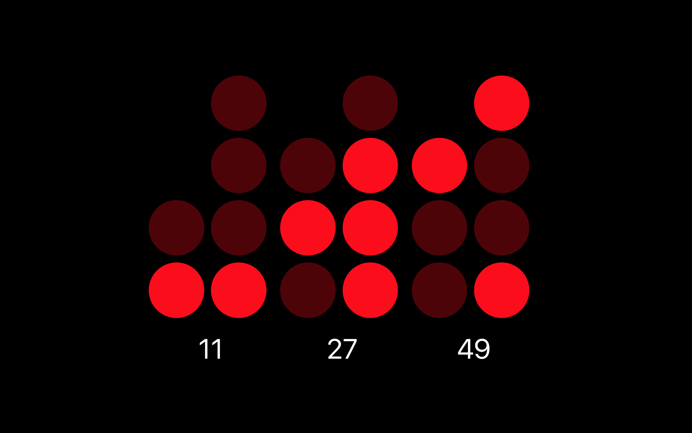

# Binary Clock
Simple Binary Clock screensaver for macOS

## Install
Download, unzip and double click the screensaver file [`Binary Clock.saver`](https://github.com/cfs100/binary-clock/releases/download/0.0.1/Binary.Clock.saver.zip)
